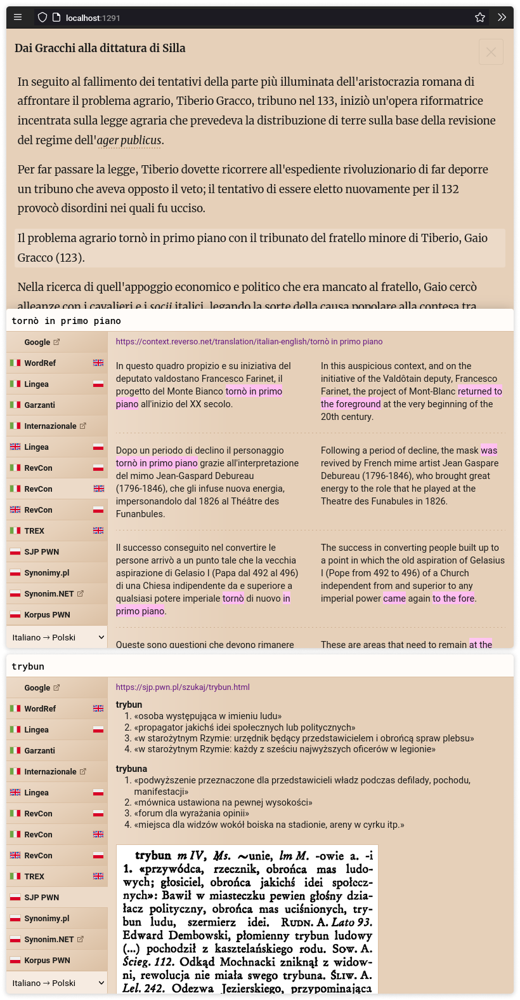

<!-- vim: set textwidth=80 colorcolumn=80: -->
<!-- markdownlint-configure-file
{
  "line-length": { "code_blocks": false },
  "no-inline-html": false
}
-->
# Coditra

> A translator’s companion for desktop. Select fragments of a text document and
> quickly look them up in online dictionaries

Coditra is a locally run web application intended as support in translation of
text. Its main feature are quick dictionary lookups, whereby results are pulled
from various online dictionaries and presented in a clear form directly in the
user interface.

Coditra comes with several built-in lookup sources. Adding a custom source
requires writing an adapter and compiling it together the server portion of the
program as well as writing a UI component for the client portion of the program
to display the results.

Supports Linux, Windows, and (theoretically — untested) macOS.

Built with [Go](https://go.dev/) and [Svelte](https://svelte.dev/).

<p align="center">
  
</p>

## Installation

Binary releases are not currently available. The program must be built from
the source:

Requirements: `Yarn 1` (or equivalent), `go`.

1. Clone

    ```sh
    git clone "https://github.com/fauu/coditra"
    ```

1. Build the client

    ```sh
    cd coditra/client
    yarn install
    yarn build
    ```

1. Build the server

    ```sh
    cd ..
    ./scripts/server-prebuild.sh
    cd server
    go build -o target/coditra cmd/coditra/main.go
    ```

The self-contained executable for the program is now ready at
`server/target/coditra[.exe]`.

The web interface will be accessible at <http://localhost:1291>.

## Configuration

On first launch, the program will create a default configuration file
([`config/config.sample.nt`](config/config.sample.nt)) in:

**Linux**<br>
`$XDG_CONFIG_HOME/coditra/config.nt` (usually `~/.config/coditra/config.nt`)

**Windows**<br>
`%APPDATA%\coditra\config.nt` (usually `C:\Users\<username>\AppData\Roaming\coditra\config.nt`)

**macOS**<br>
`~/Library/Application Support/coditra/config.nt`

Before using Coditra, this file must be edited: a value for the key
`documentsDir` must be specified.

### File format

The configuration file is a [NestedText](https://nestedtext.org/en/stable/)
file. Below is an annotated example describing its expected shape.

```sh
# Path of the directory containing HTML documents to be read by Coditra
documentsDir: /home/<user>/documents/translation-texts
# The user agent used by the lookup adapters to access internet resources. When
# this entry is absent, a defualt defined in the file `server/config.go` is
# used
userAgent: Mozilla/5.0 (Windows NT 10.0; Win64; x64) AppleWebKit/537.36 (KHTML, like Gecko) Chrome/99.0.4844.51 Safari/537.36
# Simple lookup sources that do not need to be programmed as all they do is
# open the specified URL in a new browser tab
lookups:
  -
    # Used to refer to this source in other places in the configuration file
    id: bob
    # Displayed in the user interface
    name: Bob
    # {input} is substituted with the user’s query string and the resulting URL
    # is navigated to in a new browser tab
    url: https://www.google.com/search?q={input}
    params:
      # Determines the flag displayed in the corresponding button in the UI
      sourceLang: fr
# Sets of lookup buttons displayed on the left side of the lookup panel
setups:
  -
    # Displayed in the UI
    name: Français 🡒 Polski
    # List of buttons
    lookups:
      # Refers to the entry with id `bob` defined in the `lookups` field above
      - bob
      # Refers to the key referencing the wordreference.com lookup source as
      # defined in the `LookupSources` map in the file `server/server.go`. "fr"
      # and "en" refer, respectively, to the `sourceLang` and `targetLang`
      # parameters which are handled in the lookup source implementation (in
      # this case in the `server/lookups/wr.go` file).
      - wr(fr, en)
```

## Input documents

Coditra uses HTML files as input. For best results, however, a Markdown file
should be fed to it first in order to produce a HTML file specifically tailored
for use with it. This enables features that make it easier for you to remain
oriented within the text while constantly context-switching between it and the
lookup results. Specifically, those features are: displaying each sentence in
its own paragraph and letting you highlight a sentence you are currently working
on by clicking on it.

To convert a Markdown input file to a prepared HTML file, run:

```sh
coditra --prepare <filename>.md <filename>.html
```

## Usage tips/notes

* Initiating text selection by with double click instead of a single click makes
  it snap to full words.

* You can use `pandoc` to easily create an input Markdown file directly from a
  text selection made in web browser. For example (Linux Wayland version):

  ```sh
  wl-paste -t text/html | pandoc -r html -w markdown-raw_html-native_divs-native_spans-fenced_divs-bracketed_spans > <filename>.md
  ```

* Successful lookup requests are cached in memory until the program is
  restarted.

## Known issues

* SJP PWN lookup: some results as well as “internal” cross-references not
  picked up. For example of both see <https://sjp.pwn.pl/sjp/szukaj/mistrz>
  (under “wielki mistrz”).

* Lingea lookup: unhandled cases:
  <https://slowniki.lingea.pl/wlosko-polski/nella>,
  <https://slowniki.lingea.pl/francusko-polski/la> (`lex_ful_desc2`).

## Development

Terminal #1:

1. `go install github.com/cortesi/modd/cmd/modd@latest` or `pacman -S modd` etc.

2. `cd server`

3. `modd`

The program will automatically rebuild and relaunch on any `.go` file change.

Terminal #2:

1. `cd client`

2. `yarn dev`

The client will be hot-reloaded on modification.

**In development, be sure to access the web UI through the address
<http://localhost:5000>, and not localhost:1291**, as the latter address will
contain a stale version of the client, not the fresh one served by the
development server.

### Adding new Lookup Sources

1. Create a new `.go` file in `server/lookup/`. You need to implement the type
   `Source` defined in [`server/lookup/lookup.go`](server/lookup/lookup.go).
   Refer to other files in [`server/lookup/`](server/lookup/) for examples.

2. Add an entry for your source to the `LookupSources` map defined at the top of
   the `RunServer()` function in the file
   [`server/server.go`](server/server.go).

3. Create a new `<Lookup Source Name>LookupResult.svelte` file in
   [`client/src/lookup`](client/src/lookup). You need to implement a Svelte
   component that receives a `lookupResult` prop with the data returned by your
   Go code. Refer to other files in [`client/src/lookup`](client/src/lookup) for
   examples.

4. Add your component to the `sourceToLookupResultComponent` map defined near
   the top of the
   [`client/src/LookupPanel.svelte`](client/src/LookupPanel.svelte) file.

5. Build the program as described in the [Installation](#Installation) section.

## License

Coditra\
Copyright (C) 2020-2022 Piotr Grabowski

This program is free software: you can redistribute it and/or modify it under
the terms of the GNU Affero General Public License as published by the Free
Software Foundation, either version 3 of the License, or (at your option) any
later version.

This program is distributed in the hope that it will be useful, but WITHOUT ANY
WARRANTY; without even the implied warranty of MERCHANTABILITY or FITNESS FOR A
PARTICULAR PURPOSE. See the GNU Affero General Public License for more details.

You should have received a copy of the GNU Affero General Public License along
with this program. If not, see <https://www.gnu.org/licenses/>.

### Third-party components

Coditra includes the following third-party components:

| Component                    | License      |
|------------------------------|--------------|
| [axios]                      | MIT          |
| [bluemonday]                 | BSD-3-Clause |
| [chi]                        | MIT          |
| [goldmark]                   | MIT          |
| [goquery]                    | BSD-3-Clause |
| [Line Awesome]               | MIT          |
| [nt-go]                      | MIT          |
| [rs/cors]                    | MIT          |
| [Svelte]                     | MIT          |

[goquery]: https://github.com/PuerkitoBio/goquery
[nt-go]: https://github.com/dolow/nt-go
[chi]: https://github.com/go-chi/chi
[bluemonday]: https://github.com/microcosm-cc/bluemonday
[rs/cors]: https://github.com/rs/cors
[goldmark]: https://github.com/yuin/goldmark/
[axios]: https://github.com/axios/axios
[Svelte]: https://svelte.dev/
[Line Awesome]: https://icons8.com/line-awesome
